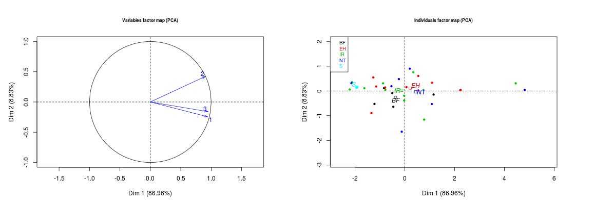

## Interpretació dels gràfics ACP

## Tips

*Els angles que formen dues fletxes entre sí, ens
mostren la correlació existent entre les corresponents
variables* [1]

El cosinus de l'angle format pels dos vectors és proporcional a la seva correlació. Com més petit sigui l'angle, més gran la correlació. Així, dues variables que quedin
representades en punts molt propers tindran vectors que formaran un angle proper a zero, fet que indica que tindran una correlació molt forta. En canvi, dues variables representades per punts molt separats i els vectors de les quals formin un angle proper a l'angle recte, seran pràcticament incorrelacionades.

*Els sentits dels vectors indiquen el signe de la correlació existent entre les
corresponents variables*

Dos vectors que tinguin una mateixa direcció però sentits oposats tindran una correlació molt forta en sentit negatiu. És a dir, valors elevats en una variable es corresponen amb valors baixos en l'altra.

*La posició de les variables en el gràfic mostra l'estructura de les dades i suggereix possibles interpretacions de les components principals*

El fet que hi hagi un grup de variables ben representades i en posicions properes en el gràfic indica que totes elles estan molt relacionades entre sí i que ens subministren bàsicament la mateixa informació. Quan apareixen varis grups de variables vol dir que hi ha diferents aspectes descrits per la matriu de dades. També el fet que alguna variable quedi molt ben representada i que en el gràfic li correspongui un punt proper a un dels eixos de coordenades, ens està indicant que una de les dues primeres components principals està fortament correlacionada amb aquesta variable i, per tant, se li pot donar una interpretació similar.

## Exemple anàlisi gràfics
 

 - Es pot observar una correlació alta [1] entre el tractament 3 i el tractament 1.
 - La correlació del tractament 2 amb els altres tractaments és més feble.
 - La gràfica de la dreta ens mostra els gens i la seva funció, agrupacions clares entre els gens ens podríen indicar possibles clústers o comportaments.
