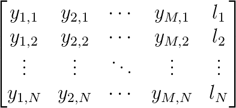

```{r setup, include=FALSE}
knitr::opts_chunk$set(echo = TRUE, size = "footnotesize")
```

# Caso de estudio

- Definir el problema
- Se diseña un experimento con el objetivo de...

# Estructura del proyecto

<center>
Problema $\rightarrow$ Protocolo $\rightarrow$ Aplicación $\rightarrow$ Conclusiones
</center>

# Datos de expresión genética

- Presentar la obtención de los datos
- Los datos son...
- La medida es..

{width=200px}

# Protocolo de análisis

## Objetivos del análisis

1. Detectar genes que se expressan...
2. Buscar diferencias entre tratamientos..
3. Patrones...


----
# Protocolo de análisis

## Hipotesis planteadas

1. En algun gen (y cuál o cuales) hay diferencias significativas entre los niveles de expresión entre tatamientos?
2. Entre cúales tratamientos (parejas) hay diferencias significativas?


# \bsmall En algun gen (y cuál o cuales) hay diferencias significativas entre los niveles de expresión entre tatamientos? \esmall

- ANOVA para comparar medias entre grupos/tratamientos.
- Cada gen es una variable. (Expresión del gen)
- Diseño balanceado y normalidad en los datos.
- *Ejemplo: En una muestra de 26 individuos, hacemos un experimento con 4 tratamientos. Si aplicamos ANOVA para el gen TFF3:*

```{r,results='asis',echo=F,message=FALSE,warning=F}
options(xtable.comment = FALSE)
require(xtable)
taula <- data.frame("Gen"=c("TFF3"),"F"=c(5.295),"Pvalor"=c(0.005))
colnames(taula) <- c("Gen","$F_{k-1,N-k}$","P-valor")
rownames(taula) <- ""
print(xtable(taula,digits=c(0,0,2,3)),sanitize.text.function=function(x){x})

```
- Suponemos que tenemos 20 genes, aplicamos el ANOVA para cada gen y listo?

# \bsmall En algun gen (y cuál o cuales) hay diferencias significativas entre los niveles de expresión entre tatamientos? \esmall

- Cuando realizamos un test podemos cometer el error de rechazar la hipotesis nula cuando realmente es cierta. (Error de tipo I)

## Cálculo de probabilidades
- Si $H_{0}$ es cierta: $P(FP)=\alpha$ y $P(VP)=1-\alpha$
- $P($Almenos un $FP$ en $m$ tests$)=1-(1-\alpha)^m$
- Para $m=1$, $P($Almenos...$)= 1-(1-0.05)^1=0.05$
- Para $m=50$, P(Almenos...$)= 1-(1-0.05)^{50}=0.92$ 

# \bsmall En algun gen (y cuál o cuales) hay diferencias significativas entre los niveles de expresión entre tatamientos? \esmall

- Corregir los p-valores para controlar el error de tipo I

## False Discovery Rate (FDR)
- Proporción esperada de falsos positivos entre todos los tests considerados como significativos.
- El método para controlar el FDR: Benjamini$\&$Hochberg.
- Falta...
{width=300px}


# \bsmall Entre cúales tratamientos (parejas) hay diferencias significativas? \esmall

- De los genes que han salido significativos en el ANOVA, hacemos comparaciones 2 a 2 entre las medias de los grupos.

- Utilizamos el método de Tukey:


# Análisis descriptivo

1. Heatmap
2. Representación ACP
3. LinePlot

# Aplicación en Shiny

La idea principal era crear una herramienta de análisis para los grupos de investigación.

- Desarrollada en R con el paquete Shiny.
- Interactiva, sencilla y accesible.
- Repositorio público.

https://github.com/djangosee/TFGShinyApp

# Conclusiones


